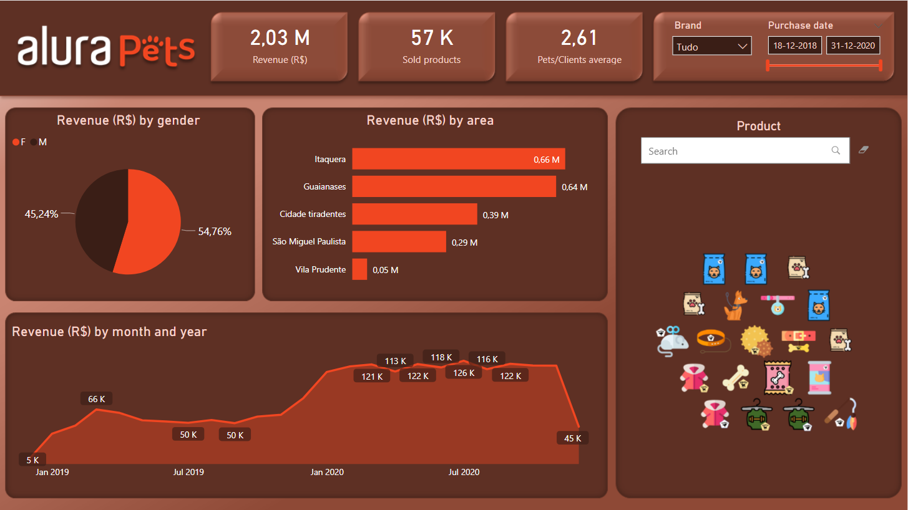

# Power Bi  - First project

I've just starting learning about the data science world and one of the things that I was interested in learning was Power BI. So, this is my first project using this tool.

This project was from [Alura](https://www.alura.com.br/), a brazilian online platform with several courses within the technological area. 
This course specific was "Power BI Desktop: Carregue, analise e visualize dados" and I learned: how to import dataset from excel, `.txt` and google sheets; how to make operations between different tables; how to handle data, such as cleaning null fields; how to build a dashboard.
The project consisted in create a dashboard for a small petshop store showing informations such as: revenues, amount of sold products, revenues by gender and by areas, and by month and year. By doing that, I was able to use different kinds of graphics and filters.
The dataset was provided by Alura through a zip file and also by a [google sheets link](https://docs.google.com/spreadsheets/d/e/2PACX-1vSi6zD0nOJDf4YVOBQVXuSpAwihl4i5H4vrv7PjM3y0l0M-oHOaWYRrVXrZ1o3TOUFNnzo3sSi9b0Pu/pubhtml).

Below you can find a screenhot of my  :)
